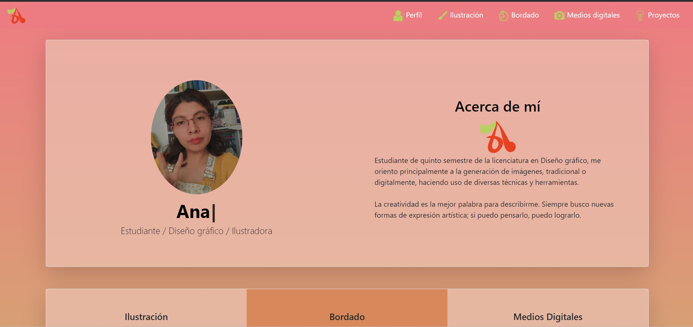

# Portafolio
Proyecto realizado en el bootcamp de "Technolochicas PRO Summer 2023", con el fin de poner en practica conocimientos básicos de programación web con el uso de HTML y CSS; y además para recopilar evidencias de mis habilidades.
Es una página web responsiva *(adaptable a diversos tamaños de pantalla)*.

El propósito del sitio web es mostrar el portafolio de proyectos de un(a) desarrollar(a) y su experiencia

Incluye uma descripción de mi perfil, habilidades, proyectos, catálogo de imágenes y formas de contacto.

También contiene una sección de almacenamiento de archivos *(imágenes)* que nos permiten modificar la imagen de perfil del desarrollador y contiene una animación desarrollada con JavaScript.

Aquí puedes visitar la página: https://regal-biscuit-69ea88.netlify.app/index.html#proyectos

## Tecnologías

Esta página fue creada con:

* HTML 5
* CSS 3
* Javascript
* Bootstrap

## Español
El texto e la página web escrito en español, sin embargo las clases relacionadas con Bootstrap se incluyen en inglés.

## Contacto

Desarrollado en: Tecnolochicas PRO Summer Camp

Ana Contreras
